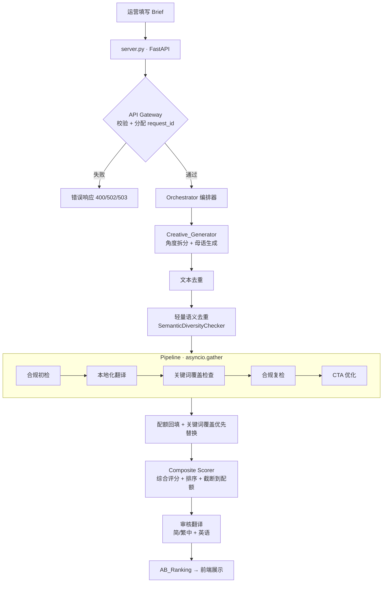

<div align="center">

# 🎯 Creative Editor Agent

**Coco AI 多市场广告创意生成 Agent**

一次请求，产出 **15 条标题 / 10 条描述 / 5 条 CTA**，自动完成合规检查、母语本地化、
关键词嵌入与 A/B 排序——覆盖 **46 个市场 · 20 种语言 · 3 大广告平台**。

<p>


</p>

</div>

---

## 📖 目录

- [项目简介](#-项目简介)
- [核心特性](#-核心特性)
- [快速开始](#-快速开始)
- [系统架构](#-系统架构)
- [API 用法](#-api-用法)
- [配置项](#-配置项)
- [多语言支持](#-多语言支持)
- [项目结构](#-项目结构)
- [测试](#-测试)
- [文档导航](#-文档导航)
- [常见问题](#-常见问题-faq)

---

## 🌍 项目简介

Coco 是一家面向多个国家市场的**游戏充值平台**。用户在各地为游戏账户充值（topup），
平台需要在 Google Ads、Meta、TikTok 等渠道大量投放广告来获客。运营人员原本要为每个
市场手写大量广告文案，还要逐条做合规检查、翻译成当地语言、嵌入 SEO 关键词——既慢，
又容易踩广告平台的政策红线（充值/博彩类业务尤其容易被审核误判）。

**Creative Editor Agent** 把这套流程自动化：运营只需填一份 `Creative_Brief`，
系统就会编排五个工具，端到端产出一组**合规、本地化、差异化、带评分**的广告创意，
并按综合分排好序供运营挑选。

> **业务价值**：运营从"一小时手写 5-10 条"变成"约 40 秒产出一整个广告组（15/10/5）"，
> 且每条都做了合规与差异化处理。

---

## ✨ 核心特性

| 能力 | 说明 |
|------|------|
| 🎯 **精确配额** | 一次交付精确的 15 标题 / 10 描述 / 5 CTA（业务方硬指标，可按需覆盖） |
| 🧬 **三层差异化** | 文本去重 → 轻量语义去重（纯标准库词法相似度，阈值 0.50，零额外依赖）→ 创意角度拆分，保证同组文案不雷同 |
| 🌐 **母语生成 + 本地化** | 20 种语言直接用母语创作（非翻译英文稿），覆盖 46 个目标市场 |
| 🔑 **关键词覆盖优先** | 语义去重淘汰的近义候选进入储备池；当正选缺关键词时自动替补，保证 SEO 覆盖 |
| 🈳 **多语言关键词匹配** | 按书写系统/语言形态智能匹配（中日泰子串、俄语词干、阿语冠词粘连…），杜绝误报 |
| 🛡️ **合规检查** | 本地违禁词词典拦截赌博保证、医疗承诺、虚假紧迫感等违规表述 |
| 📋 **审核翻译** | 交付文案翻成简体中文 / 繁体中文 / 英语，供香港运营审核外语文案 |
| 🔄 **常换常新** | "换一批"可避开历史文案，规避广告平台审核误判 |
| ⚡ **批量并发** | 标题 + 描述 + CTA 三类并发生成，批量约 35-45 秒 |
| 🖥️ **开箱即用前端** | 自带 Web 界面（无需前端构建），支持批量生成、中断、自定义约束 |
| 🧪 **属性测试驱动** | 213 个测试（含 Hypothesis 属性测试），覆盖正确性属性 |

---

## 🚀 快速开始

### 环境要求

- Python **3.10+**
- 一个阿里云百炼（DashScope）API Key

### 安装与启动

```powershell
# 1. 创建并激活虚拟环境
python -m venv .venv
.\.venv\Scripts\Activate.ps1            # Windows
# source .venv/bin/activate             # macOS / Linux

# 2. 安装依赖
pip install -r requirements.txt

# 3. 配置 LLM 凭据（交互式，隐藏输入，自动锁权限）
python setup_env.py
#   或手动：copy .env.example .env  然后填入 API Key

# 4. 启动服务（会自动弹出浏览器）
python server.py
```

启动后访问：

| 地址 | 用途 |
|------|------|
| http://localhost:8001 | 🖥️ 前端界面（填表单生成创意） |
| http://localhost:8001/docs | 📚 Swagger API 文档 |
| http://localhost:8001/health | ❤️ 健康检查 |

> 💡 端口固定为 **8001**（8000 常被其他服务占用）。详细运行说明见 [`START.md`](START.md)。

---

## 🏗️ 系统架构



**设计要点**：

- **Orchestrator-Driven** 而非自由 ReAct——时延和合规是硬约束，需要显式编排控制。
- **工具与 LLM 解耦**：`LLMClient` 抽象基类 + `RealLLMClient`（DashScope）/ `MockLLMClient`（测试）。
- **优雅降级**：任一工具失败不中断整体，记录 `warning`；累计失败超阈值才熔断。
- **综合评分**：`0.5 × 合规 + 0.25 × 关键词覆盖 + 0.25 × CTA 强度`。

---

## 🔌 API 用法

### 单类型生成 · `POST /api/creative`

```bash
curl -X POST http://localhost:8001/api/creative \
  -H "Content-Type: application/json" \
  -d '{
    "campaign_topic": "Game topup bonus weekend",
    "target_platform": "GOOGLE_ADS",
    "target_market": "RU",
    "creative_type": "HEADLINE",
    "keywords": ["topup", "bonus"],
    "selling_points": ["20% extra credit", "instant delivery"]
  }'
```

### 批量生成（标题 + 描述 + CTA）· `POST /api/creative/batch`

省略 `creative_type`，系统并发跑三种类型，返回 `{ headlines, descriptions, ctas, total_time_ms }`。

### Brief 字段速览

| 字段 | 必填 | 说明 |
|------|:----:|------|
| `campaign_topic` | ✅ | 活动主题（1–200 字符） |
| `target_platform` | ✅ | `GOOGLE_ADS` / `FACEBOOK_ADS` / `TIKTOK_ADS` |
| `target_market` | ✅ | 46 个市场之一（如 `RU` / `SA` / `EN_GLOBAL`） |
| `creative_type` | ✅ | `HEADLINE` / `DESCRIPTION` / `CTA` / `LONG_COPY` |
| `keywords` | | SEO 关键词（超 20 个自动截断） |
| `selling_points` | | 卖点列表，驱动角度拆分 |
| `target_count` | | 覆盖默认配额（1–50） |
| `must_include` / `must_avoid` | | 强制包含 / 强制规避的短语 |
| `extra_instructions` | | 自由创作指令（像给 AI 加备注） |
| `regenerate_avoid` | | 需避开的历史文案（常换常新） |

---

## ⚙️ 配置项

通过 `.env` 配置（`python setup_env.py` 可交互式生成）：

| 变量 | 默认 | 说明 |
|------|------|------|
| `TOKENPONY_API_KEY` | — | 阿里云百炼 API Key（密钥，绝不提交） |
| `TOKENPONY_BASE_URL` | `https://dashscope.aliyuncs.com/compatible-mode/v1` | DashScope 兼容端点 |
| `TOKENPONY_MODEL` | `qwen3.7-max` | 模型名（旗舰，提示词遵循强） |
| `GENERATION_TEMPERATURE` | `0.8` | 创意生成温度（0.0–2.0），仅影响文案生成 |
| `ENABLE_THINKING` | `false` | 深度思考模式。**保持 false**——开启会让批量生成慢到数分钟 |

> ⚠️ **关于 `ENABLE_THINKING`**：Qwen3.x / DeepSeek V4 等新模型默认开启"深度思考"，
> 会在回答前输出大段隐藏推理。本项目一次生成调用 LLM 数十次，开启后延迟无法接受，
> 因此默认关闭。详见 [`docs/`](docs/)。

---

## 🌐 多语言支持

关键词匹配按**书写系统 + 语言形态**自动选择策略，避免"明明有关键词却报缺失"的误判：

| 策略 | 适用语言 | 例子 |
|------|---------|------|
| 严格整词 | 英语、越南语 | `play` ≠ `player` |
| 子串匹配 | 中 / 日 / 泰 / 高棉 / 阿拉伯 / 印地 / 韩 | 充值、`الشحن`、เติมเงิน |
| 西里尔词干 | 俄语、哈萨克语 | `бонус` → `бонусом` |
| 拉丁词干（后缀） | 西 / 葡 / 土耳其 | `recarga` → `recargas` |
| 拉丁词内子串（前缀） | 印尼 / 马来 / 菲律宾 / 斯瓦希里 | `isi` → `pengisian` |

完整市场—语言对照与策略说明见 [`docs/MARKET_LANGUAGES.md`](docs/MARKET_LANGUAGES.md)。

---

## 📁 项目结构

```text
creative_editor_agent/
├── src/creative_agent/
│   ├── api/             # API Gateway、请求校验、顶层入口
│   ├── orchestrator/    # 编排逻辑、Composite Scorer、单候选流水线
│   ├── tools/           # 五个核心工具 + 关键词匹配
│   ├── integration/     # 角度拆分、语义去重、本地化、审核翻译
│   ├── models/          # Pydantic v2 数据模型与枚举
│   ├── config/          # Platform_Spec / 违禁词词典加载
│   ├── observability/   # 结构化日志、Trace 记录
│   ├── errors/          # 错误码与响应模型
│   └── llm/             # LLM 客户端抽象（Real / Mock）
├── tests/               # unit / property / integration（213 个）
├── docs/                # 架构、政策、语言、安全等文档
├── scripts/             # demo 与基准脚本
├── frontend.html        # 自带 Web 前端
├── server.py            # FastAPI 启动入口
├── setup_env.py         # 交互式密钥配置
└── START.md             # 运行指南
```

---

## 🧪 测试

```powershell
pytest tests/                  # 全部 213 个测试
pytest tests/unit -q           # 仅单元测试
pytest tests/property -q       # 仅属性测试（Hypothesis）
```

测试分三层：**单元**（工具逻辑）、**属性**（正确性属性，如"合规过滤后无 BLOCK"、
"评分值域 0–1"、"翻译占位符保留"）、**集成**（mock LLM 端到端 + 真实 LLM 冒烟）。

---

## 📚 文档导航

| 文档 | 内容 |
|------|------|
| [`START.md`](START.md) | 开机到启动的完整运行步骤 |
| [`docs/CODE_GUIDE.md`](docs/CODE_GUIDE.md) | 45 分钟按调用链读懂代码 |
| [`docs/WORKFLOW.md`](docs/WORKFLOW.md) | 请求全流程思维导图（Mermaid） |
| [`docs/PROJECT_FLOW.md`](docs/PROJECT_FLOW.md) | 架构总览与技术决策 |
| [`docs/MARKET_LANGUAGES.md`](docs/MARKET_LANGUAGES.md) | 46 市场 × 20 语言 × 匹配策略 |
| [`docs/AD_POLICIES.md`](docs/AD_POLICIES.md) | 三平台广告政策与字符限制 |
| [`docs/SECURITY.md`](docs/SECURITY.md) | API Key 与密钥保护规范 |

---

## ❓ 常见问题 (FAQ)

**Q：为什么换了 qwen3.7-max 反而五分钟跑不完？**
A：新模型默认开启"深度思考"。设 `ENABLE_THINKING=false`（已是默认）即可恢复到约 40 秒。

**Q：为什么有时提示"关键词未放入文案"？**
A：语义去重在关键词检查之前，偶有文案缺关键词。系统会用储备池中含关键词的近义候选自动替补；
若实在无可替补才保留并提示。

**Q：能直接双击打开 `frontend.html` 吗？**
A：不能。必须通过 `python server.py` 启动，否则 `file://` 协议下前端无法调用后端 API。

**Q：改了 `.env` 或后端代码不生效？**
A：需要 `Ctrl+C` 停止后重新 `python server.py`。

---

<div align="center">

详细需求 / 设计 / 任务文档见 `.kiro/specs/creative-editor-agent/`

</div>
