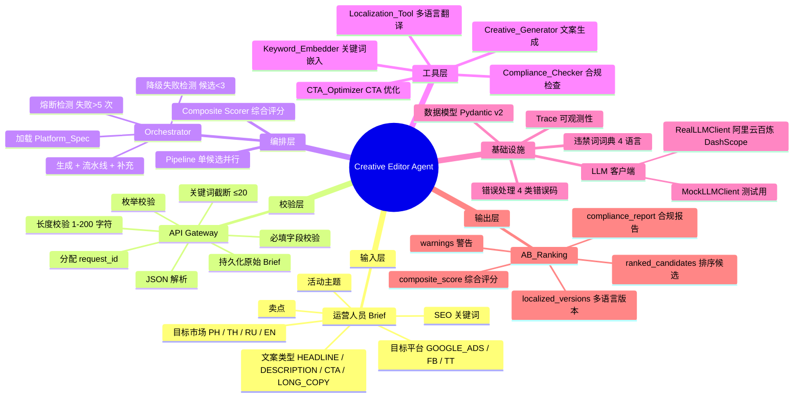
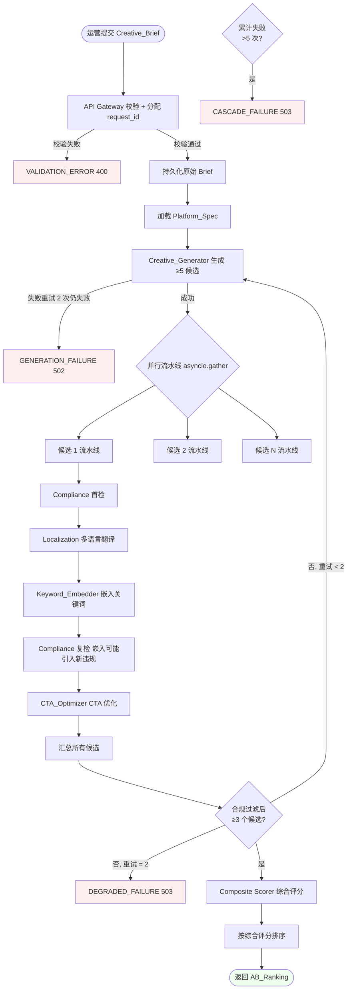
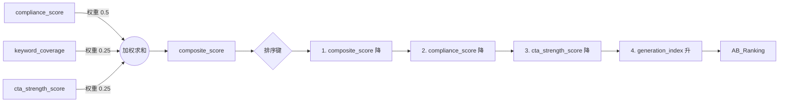
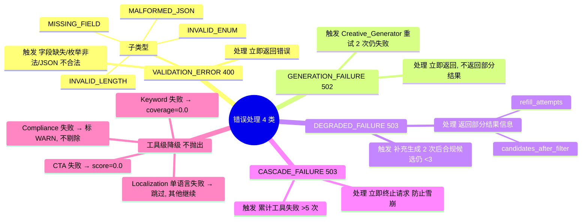
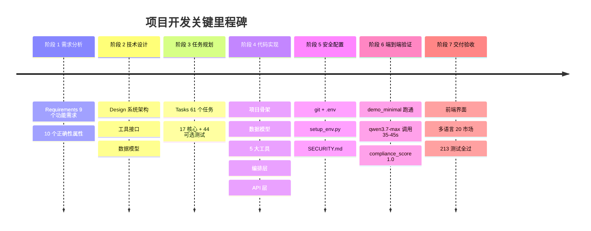
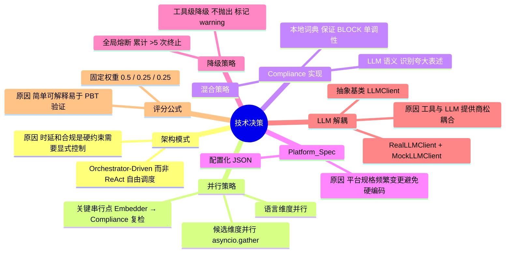

# Creative Editor Agent — 项目流程思维导图

> Coco AI 创意编辑工具 Agent 的端到端流程梳理

---

## 一、整体架构总览



---

## 二、端到端处理流程



---

## 三、五大核心工具职责拆解

```mermaid
mindmap
  root((五大核心工具))
    Creative_Generator
      输入 Creative_Brief + Platform_Spec
      输出 ≥5 个互不重复候选
      约束
        长度 ≤ char_limit
        差异化 角度/语气/卖点
        重试 ≤2 次
      调用 LLM 1 次
    Compliance_Checker
      输入 文案 + 语言
      输出 Compliance_Report
        compliance_score 0.0-1.0
        violations 列表
      检测策略 混合
        本地词典 BLOCK 类违禁词
        LLM 语义 WARN 类夸大
      评分公式
        含 BLOCK → 0.0
        N 个 WARN → max 0.1, 1 - 0.2N
        无违规 → 1.0
    Localization_Tool
      输入 源文案 + 目标市场
      输出 多语言版本
      市场映射
        PH → fil + en
        TH → th + en
        RU → ru + en
        EN_GLOBAL → en
      占位符保留 {name}
      货币符号 ₱ ฿ ₽ $
      日期格式 各市场专属
    Keyword_Embedder
      输入 文案 + SEO 关键词
      输出 嵌入后文案 + 覆盖率
      约束
        词边界匹配 大小写不敏感
        防堆砌 连续 ≤2 次
        长度 ≤ char_limit
      已存在关键词不重嵌
      覆盖率 = 命中数 / 总数
    CTA_Optimizer
      创意类型为 CTA 时
        生成 ≥5 个 CTA 候选
        合规过滤 BLOCK 剔除
      其他类型时
        识别文案末尾 CTA
        评分
      四维度评分
        verb_strength 动词号召力
        urgency 紧迫感
        benefit_clarity 收益明确
        cultural_fit 文化适配
```

---

## 四、综合评分公式



**公式**：

```
composite_score = 0.5 × compliance_score
                + 0.25 × keyword_coverage
                + 0.25 × cta_strength_score
```

---

## 五、错误处理分层



---

## 六、项目目录结构

```mermaid
graph TD
    Root[creative_editor_agent/]

    Root --> Spec[.kiro/specs/creative-editor-agent/]
    Spec --> SR[requirements.md]
    Spec --> SD[design.md]
    Spec --> ST[tasks.md]

    Root --> Src[src/creative_agent/]
    Src --> Api[api/]
    Api --> AG[gateway.py 校验]
    Api --> AH[handler.py 顶层入口]

    Src --> Orch[orchestrator/]
    Orch --> OO[orchestrator.py 主流程]
    Orch --> OP[pipeline.py 单候选流水线]
    Orch --> OS[composite_scorer.py 评分排序]

    Src --> Tools[tools/]
    Tools --> T1[creative_generator.py]
    Tools --> T2[compliance_checker.py]
    Tools --> T3[localization_tool.py]
    Tools --> T4[keyword_embedder.py]
    Tools --> T5[cta_optimizer.py]

    Src --> Models[models/]
    Models --> M1[brief.py]
    Models --> M2[candidate.py]
    Models --> M3[compliance.py]
    Models --> M4[ranking.py]
    Models --> M5[platform_spec.py]
    Models --> M6[enums.py]

    Src --> Config[config/]
    Config --> C1[platform_specs/ 3 个 JSON]
    Config --> C2[forbidden_terms/ 4 语言 JSON]
    Config --> C3[platform_loader.py]
    Config --> C4[forbidden_loader.py]

    Src --> Llm[llm/]
    Llm --> L1[client.py 抽象基类]
    Llm --> L2[real_client.py 阿里云百炼 DashScope]
    Llm --> L3[mock_client.py 测试用]

    Src --> Obs[observability/]
    Obs --> O1[logging.py 结构化日志]
    Obs --> O2[trace.py 链路追踪]

    Src --> Err[errors/]
    Err --> E1[codes.py 异常类]
    Err --> E2[responses.py ErrorResponse]

    Root --> Demo[demo_minimal.py 端到端验证]
    Root --> SetupEnv[setup_env.py token 安全配置]
    Root --> Sec[SECURITY.md]
    Root --> Env[.env 不进 git]
    Root --> Git[.gitignore 已加固]
```



---

## 七、开发进度时间线



---

## 八、关键技术决策



---

## 九、本次实习的交付物清单

| 类型 | 文件 | 说明 |
|------|------|------|
| 规范文档 | `requirements.md` | 9 个功能需求 + 10 个正确性属性，EARS 模式 |
| 规范文档 | `design.md` | 系统架构 + 工具接口 + Mermaid 流程图 |
| 规范文档 | `tasks.md` | 61 个任务，分 9 波依赖关系 |
| 核心代码 | `src/creative_agent/` | 完整 Python 实现 |
| 配置数据 | `platform_specs/*.json` | 3 个广告平台规格 |
| 配置数据 | `forbidden_terms/*.json` | 4 语言违禁词词典 |
| 端到端 demo | `demo_minimal.py` | 已验证跑通 |
| 安全工具 | `setup_env.py` | 交互式 token 配置 |
| 安全文档 | `SECURITY.md` | API key 保护规范 |
| 项目说明 | `README.md` | 快速上手 |

---

## 十、实习汇报可以怎么讲

> 我用 6 个阶段把"广告创意自动生成"这个业务需求落地成了一个可运行的 Agent。
>
> **业务价值**：原本运营人员一小时手写 5-10 条广告文案，现在 AI 一次能产出 5+ 条互不重复的候选，并且自动做合规检查（避免违反 Google Ads 政策被拒审）、多语言翻译（覆盖菲律宾/泰国/俄罗斯市场）、SEO 关键词嵌入和 CTA 优化。
>
> **技术亮点**：
> 1. **工程化的 Spec 驱动**：先写需求 → 设计 → 任务，再实现，每一步都有可追溯文档
> 2. **Orchestrator-Driven 架构**：5 个工具用显式编排，时延和合规可控
> 3. **正确性属性先行**：10 个 PBT 属性在需求阶段就锁定，比如"合规过滤后无 BLOCK"、"评分值域 0-1"、"翻译占位符保留"
> 4. **优雅降级**：单工具失败不影响整体，累计失败超阈值才熔断
> 5. **真实 LLM 验证**：接入阿里云百炼 qwen3.7-max，关闭深度思考模式后批量生成 35-45 秒，213 个测试全部通过
