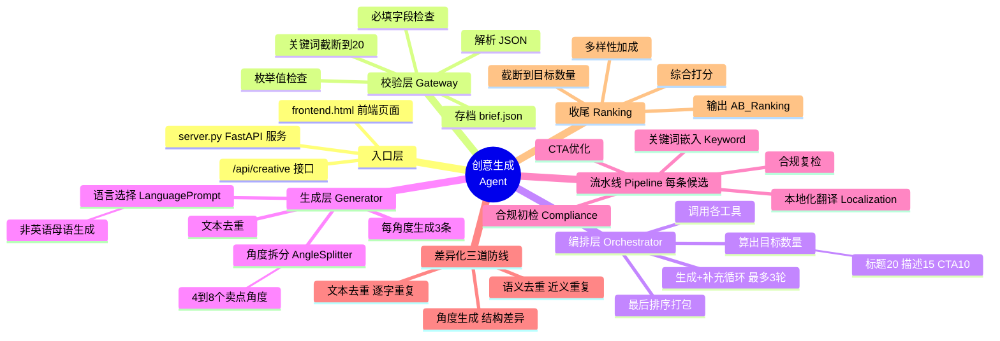
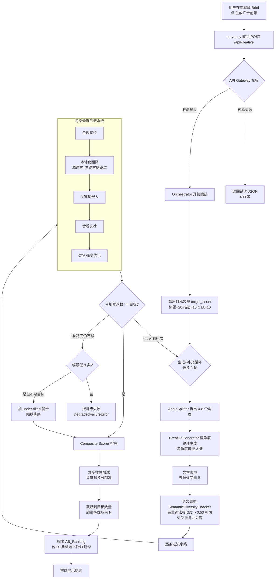
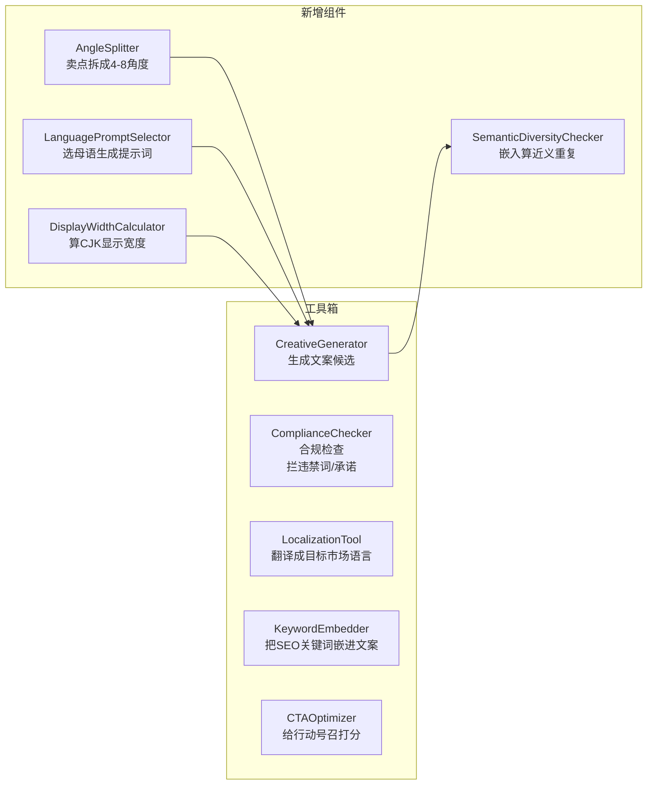
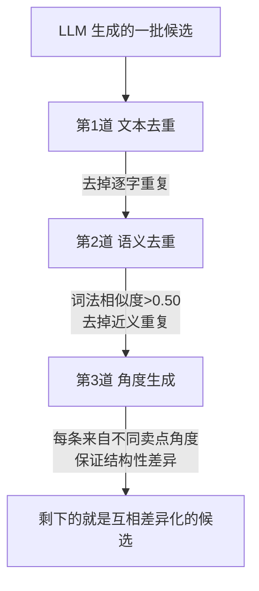

# 程序工作流说明 (Creative Editor Agent)

这份文档帮你从零理解：**一个请求从浏览器点「生成」开始，到拿到 20 条标题，中间到底发生了什么。**

> 图是用 Mermaid 画的。在 Kiro 里打开本文件，点右上角的预览（或 `Ctrl+Shift+V`）就能看到渲染后的图。

---

## 一、整体思维导图（一张图看懂全貌）



---

## 二、主流程图（请求从头到尾怎么走）



---

## 三、五个核心工具各干什么



---

## 四、关键概念（小白也能懂）

| 名词 | 大白话解释 |
|------|-----------|
| **Brief（创意请求）** | 你在前端填的那张表：主题、平台、市场、关键词、卖点 |
| **Orchestrator（编排器）** | 总指挥。决定生成多少条、循环几轮、调哪个工具、最后怎么排序 |
| **Angle（角度）** | 一个卖点切入点。比如"省钱""快速""安全"各是一个角度，保证标题不雷同 |
| **目标数量 target_count** | 这次要凑够多少条：标题20、描述15、CTA10（业务方定的，给运营留挑选余地） |
| **文本去重** | 拦"一模一样"的重复 |
| **语义去重** | 拦"换了说法但意思一样"的重复（用轻量词法相似度算分，>0.50 就丢；零额外依赖） |
| **本地化** | 把英文文案翻成目标市场语言（菲律宾语、泰语等），或直接用母语生成 |
| **合规检查** | 拦违禁词：赌博保证、医疗承诺、虚假紧迫感等 |
| **综合评分** | 合规分 + 关键词覆盖 + CTA强度 加权算出的总分，用来排序 |
| **截断** | 生成可能超量（如标题超过 20 条），最后只保留分数最高的目标数量交付 |
| **AB_Ranking** | 最终输出：排好序的候选列表 + 各项评分 + 翻译版本 |

---

## 五、差异化是怎么保证的（业务方最关心）

标题之间不雷同，靠**三道防线**叠加：



- **第1道·文本去重**：`你好` 和 `你好` → 拦掉
- **第2道·语义去重**：`Quick topup bonus access` 和 `Easy topup bonus access`（相似度0.75）→ 拦掉
- **第3道·角度生成**：强制从"省钱/快速/安全/信任…"等不同角度各生成，从源头上拉开差异

> 注意：语义去重默认使用**轻量词法嵌入**（纯 Python 标准库，零额外依赖），server 启动时瞬时就绪（日志 `server.semantic_diversity_ready`）。如需更强的"完全不同措辞但同义"识别，可在配置里设 `lightweight=False` 切回 sentence-transformers 神经模型（需额外安装，约 460MB）。

---

## 六、一句话总结运行链路

```
浏览器填表 → server 收请求 → 校验 → 编排器算目标数量(20/15/10)
→ 拆角度 → 按角度生成 → 文本去重 → 语义去重 → 逐条(合规→翻译→关键词→复检→CTA)
→ 数量够了就排序 → 多样性加成 → 截断到目标数 → 返回结果 → 前端展示
```
